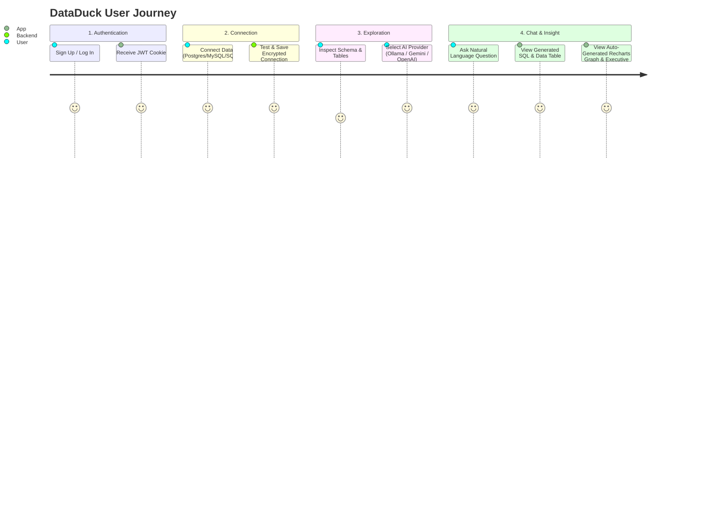

# 🦆 DataDuck Frontend — Ask. Dig. Discover.

[](https://nextjs.org/)
[](https://react.dev/)
[](https://www.typescriptlang.org/)
[](https://tailwindcss.com/)
[](https://recharts.org/)
[](LICENSE)

> **DataDuck Frontend** is a modern, responsive Web UI built with Next.js 16 App Router, React 19, TypeScript, and Tailwind CSS. It provides a chat interface, database connection manager, visual schema inspector, interactive Recharts visualizations, and natural language analytics insights.

---

## 🌟 Key Features

- 💬 **Interactive AI Chat Interface**: Ask database questions in natural plain English, stream responses, view generated SQL/MQL queries, execution timings, and row counts.
- 📊 **Dynamic Data Visualizations**: Automatic chart type detection powered by **Recharts** (Bar, Line, Pie, Area, Scatter) with customizable toggles and interactive tooltips.
- 🗄️ **Visual Schema Inspector**: Browse database schemas, view table structures, column definitions, data types, primary/foreign keys, and preview sample rows.
- 🔌 **Database Connection Hub**: Easily connect PostgreSQL, MySQL, SQLite, and MongoDB databases using connection strings or detailed form parameters.
- 📑 **Data Table & Export**: Paginated, sortable data table view with 1-click export to CSV and JSON formats.
- 🤖 **AI Model Switcher**: Switch on-the-fly between local offline LLMs (**Ollama**) and cloud models (**Gemini**, **OpenAI**, **Groq**).
- 🔐 **Secure Authentication**: User sign up, log in, session persistence, and automatic JWT token handling.
- 🎨 **Modern Aesthetics**: Sleek dark/light-compatible layout, glassmorphism UI elements, smooth transitions, and responsive mobile/desktop drawer navigation.

---

## 🛠️ Technology Stack

| Layer | Technology |
| :--- | :--- |
| **Framework** | Next.js 16 (App Router with Turbopack) |
| **UI Library** | React 19 |
| **Language** | TypeScript 5 |
| **Styling** | Tailwind CSS v4, CSS Variables |
| **Icons** | Lucide React |
| **Charts & Graphs** | Recharts 3 |
| **HTTP Client** | Axios |
| **Session & Storage**| JS Cookie / LocalStorage |

---

## 🚀 Quick Start Guide

### Prerequisites

- **Node.js**: v18.17 or higher
- **npm** / **yarn** / **pnpm**
- **DataDuck Backend API**: Ensure `ai-db-backend` is running on `http://localhost:8000`

### 1. Clone the Repository

```bash
git clone https://github.com/malviyakarishma/ai-db-frontend.git
cd ai-db-frontend
```

### 2. Install Dependencies

```bash
npm install
```

### 3. Configure Environment Variables

Create `.env.local` in the root directory:

```bash
cp .env.local.example .env.local
```

Populate `.env.local`:

```env
NEXT_PUBLIC_API_URL=http://localhost:8000/api
```

### 4. Start Development Server

```bash
npm run dev
```

Open [http://localhost:3000](http://localhost:3000) in your browser.

---

## 🧭 Workflow & User Journey



---

## 📁 Repository Structure

```
ai-db-frontend/
├── app/
│   ├── chat/             # AI chat interface page & message components
│   ├── dashboard/        # Main analytics & database overview dashboard
│   ├── databases/        # Connection manager & visual schema inspector
│   ├── login/            # Login authentication page
│   ├── signup/           # User registration page
│   ├── settings/         # AI provider selection & system configuration
│   ├── globals.css       # Global styles & Tailwind v4 imports
│   ├── layout.tsx        # App root layout, theme context, navbar & sidebar
│   └── page.tsx          # Landing page & feature showcase
├── components/
│   ├── charts/           # Recharts wrappers (DataVisualization.tsx)
│   └── ui/               # Reusable UI components (DataTable.tsx, Buttons, Cards)
├── lib/
│   ├── api.ts            # Axios API client, interceptors, endpoints
│   └── types.ts          # TypeScript interfaces (User, DBConnection, ChatMessage)
├── public/               # Static assets & icons
├── package.json          # Node dependencies & scripts
├── next.config.ts        # Next.js configuration
└── README.md             # Documentation
```

---

## 📜 Available NPM Scripts

- `npm run dev` — Starts Next.js development server on `http://localhost:3000`.
- `npm run build` — Builds production bundle.
- `npm run start` — Runs compiled production build.
- `npm run lint` — Runs ESLint code quality checks.

---

## 🤝 Contributing

Contributions are welcome! Please feel free to open Issues or submit Pull Requests.

1. Fork the repo.
2. Create a branch (`git checkout -b feature/ui-improvement`).
3. Commit changes (`git commit -m 'Enhance chart rendering UI'`).
4. Push to branch (`git push origin feature/ui-improvement`).
5. Create Pull Request.

---

## 📄 License

Distributed under the MIT License. See `LICENSE` for details.


